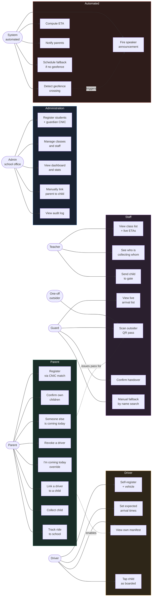
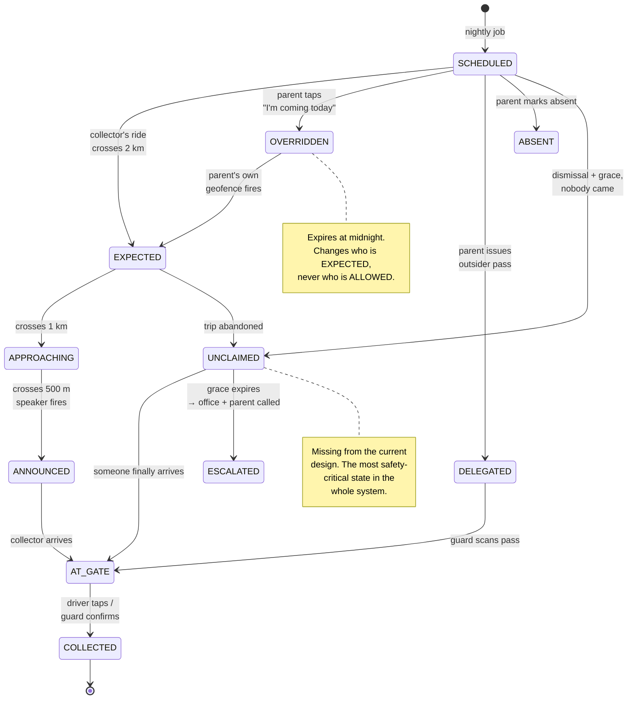
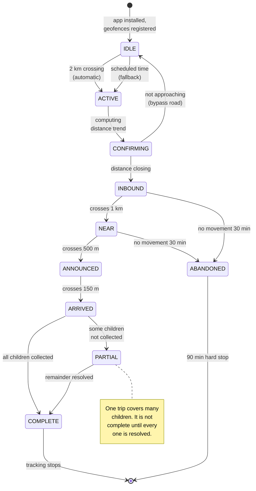
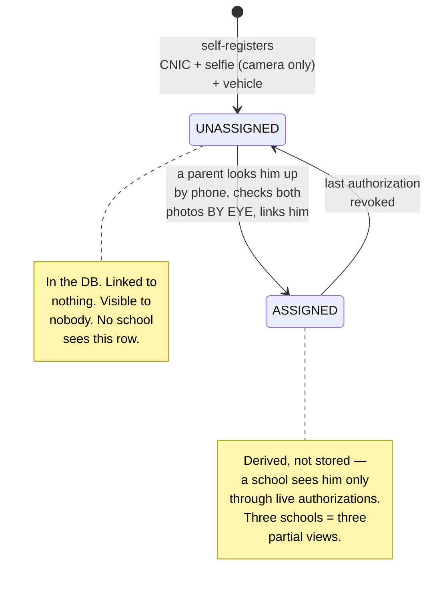
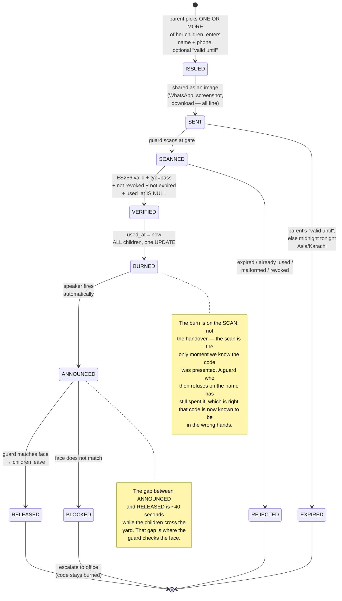
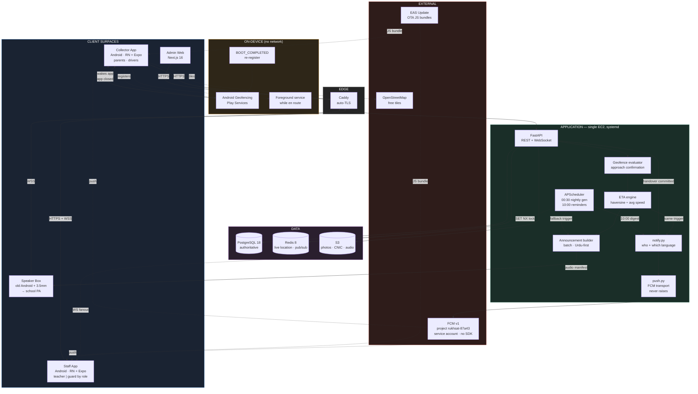
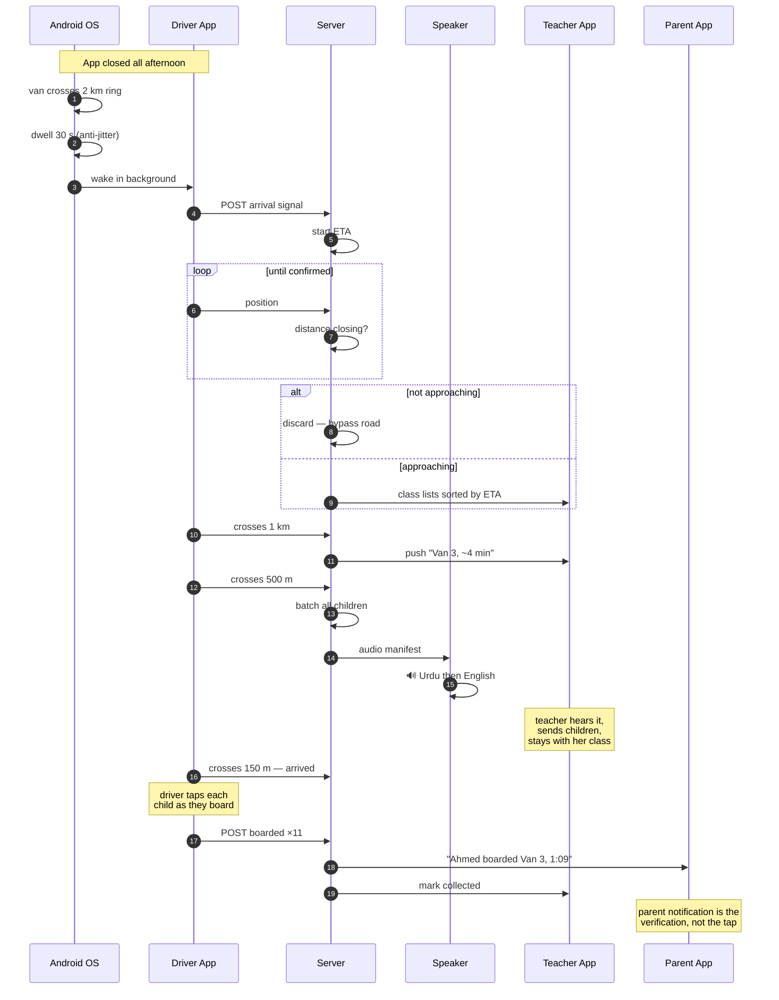
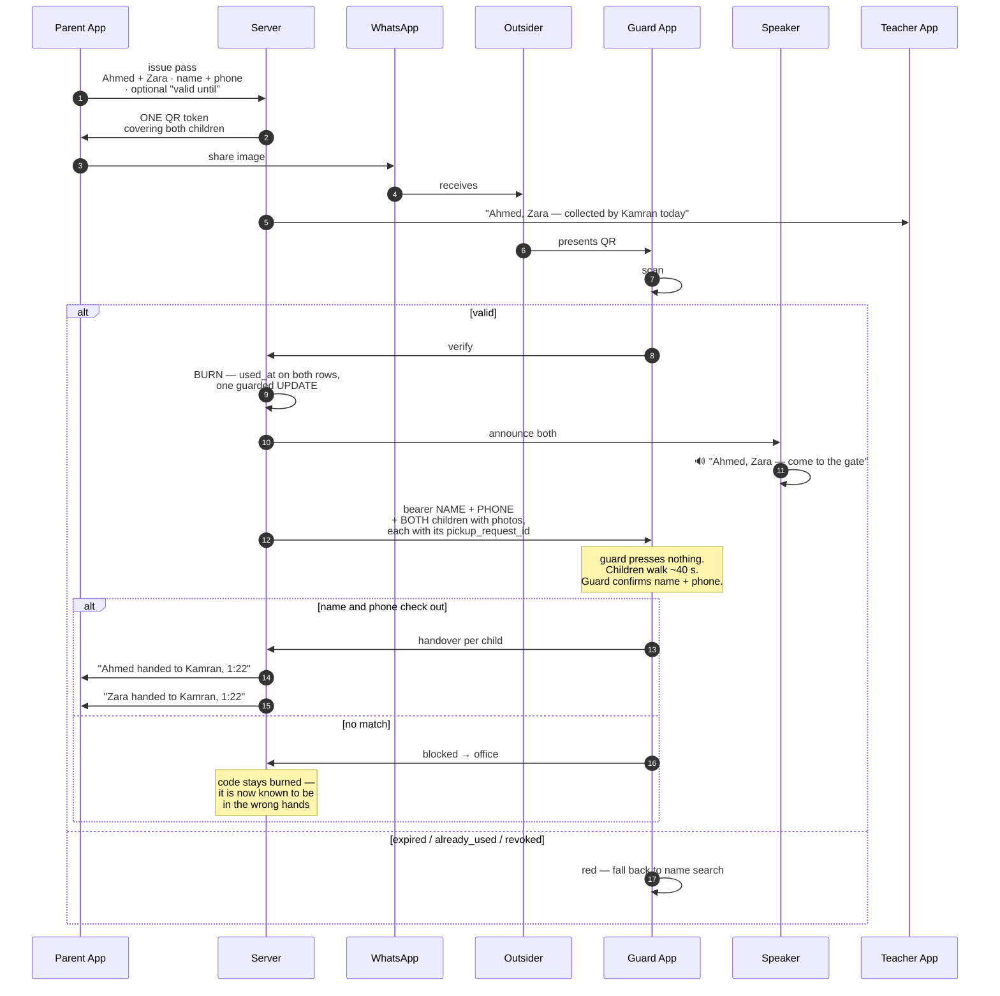
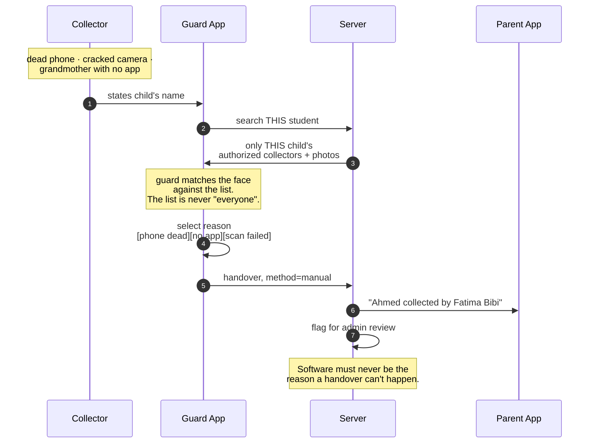
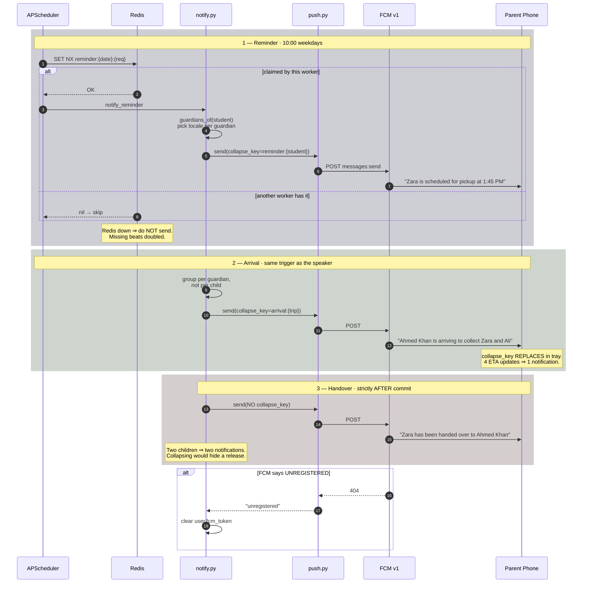

# Rukhsat — System Diagrams

**Companion to `HANDOUT.md`.** Started as a proposal; most of it has since
shipped. Each section now says which it is — where the built system differs from
what was proposed, the difference is called out rather than quietly edited away.

**Current against `37c8487`, 8 Aug 2026.** All 44 modules are built. Only one
element of the proposal remains genuinely open — see §7.

Diagrams are Mermaid — they render natively on GitHub, no tooling needed.

**Contents**

1. [Use Case Diagram](#1-use-case-diagram) — who can do what
2. [Activity Diagram](#2-activity-diagram) — the afternoon, end to end
3. [State Diagrams](#3-state-diagrams) — pickup, trip, driver, pass
4. [System Architecture](#4-system-architecture) — components and how they connect
5. [Sequence Diagrams](#5-sequence-diagrams) — collection paths and notifications
6. [Data Model](#6-data-model) — entities and relationships
7. [Status against `main`](#7-status-against-main) — what shipped, what is open

---

## 1. Use Case Diagram

Who can do what. Note what is **absent**: a driver has no path to search or
browse students. That endpoint does not exist.



### The two rules this diagram encodes

**Only a parent grants access to a child.** `P3 → D3` is the only edge that
fills a driver's manifest. There is no admin bulk-assign, and no driver
self-claim.

**No student search for drivers.** There is deliberately no `D-x` box for
"find students." Even a zero-result search confirms whether a child attends the
school, so the endpoint must not exist — a missing endpoint cannot be called
with a broken role check.

---

## 2. Activity Diagram

One afternoon, all actors, swimlaned. This is the **van path**; the parent and
outsider paths are in §5.


### Four things to notice

**The driver's lane is nearly empty.** One action at registration, one tap per
child at the gate. Everything between is the OS and the server. That is the
whole design goal — he never has to remember anything.

**`s11` is the fallback and it is load-bearing.** Geofences fire late or not at
all: Android batches events, and Xiaomi/Oppo/Vivo/Infinix kill background apps
aggressively — all extremely common here. If the driver's own expected arrival
time passes with no geofence, announce anyway. The school never notices the
difference.

**`s3` prevents the failure that would kill adoption.** A 2 km circle includes
bypass roads. Announcing for a van that never arrives destroys teacher trust,
and trust doesn't come back. One confirmation cycle costs 30 seconds and is
worth it.

**`t4` — the teacher never leaves.** She has 30 children, maybe 8 registered.
Every flow that pulls her to the gate fails at the most chaotic minute of the
day. `SYSTEM_PLAN.md` already caught this once; it's easy to lose again.

---

## 3. State Diagrams

### 3.1 Pickup — per child, per day



**`UNCLAIMED` and `ESCALATED` do not exist in the current model.** "Parent never
comes" is the single most safety-critical scenario in this domain and neither
the original plan nor the shipped contract has a state for it. A child standing
at the gate after dismissal must produce an alert, not silence.

**`OVERRIDDEN` never restricts.** If the mother taps "I'm coming today" and then
her car breaks down, the driver can still collect. The override changes
*expectation*, not *authorization* — otherwise a well-meaning tap strands a
child.

### 3.2 Trip — per collector, per day



**Tracking stops at `COMPLETE`.** No forgotten sessions, 90-minute hard cap.

**`PARTIAL` matters for vans.** One trip, fourteen children. If the driver taps
eleven and drives off, the trip is not complete and three children are
unaccounted for. Marking the trip done on arrival would silently lose them.

### 3.3 Driver registration



**No admin approval step.** The van is a private contract between parent and
driver. The school is not party to it and should not carry the liability of
having "approved" anyone. When a lawyer asks who approved this man, the answer
is *"the parent did, on 3 September, here is the log."*

**No automated face matching** — agreed with Tehman, shipped in `9594e8b`. Both
photos are stored and shown; the **parent verifies by eye** when she links him.
An algorithm reporting "82% match" is worse than a person looking at a picture:
she already knows the man she hired, and if the score disagreed with her, either
she overrides it (so it did nothing) or it overrides her (so it blocks on worse
evidence). It also drops an ML dependency that would need its own cost,
accuracy, and biometric-privacy justification.

What survives from the original proposal is the part doing the actual work:
**camera-only selfie for drivers**. A gallery upload can be any image off the
internet, and the driver is the highest-privilege actor in the system.

**`ASSIGNED` is derived, not a stored flag** — Tehman's improvement on the
proposal. A stored flag drifts: revoke the last link and a stale `ASSIGNED`
leaves a driver visible to a school he no longer serves.

### 3.4 One-off outsider pass — **SHIPPED**

`backend/app/routers/passes.py`, `POST /students/{id}/temporary-pass` and
`POST /passes/verify`. Landed in `e031bca`; multi-child passes, parent-set
expiry, and the per-pass burn were added afterwards. The diagram below is
description, not proposal.

**This is a STATIC QR, and deliberately so** — not a variant of the rotating
trip token in `qr_tokens.py`.

Rotation exists because a registered collector's code is *long-lived*: she shows
it every day for a year, so a leaked screenshot would work forever. This pass
has no such problem — it is scoped to one child, one person, one use. And the
delivery method requires it: a code sent as a WhatsApp image cannot rotate.



### One pass, several children

A relative sent to fetch three siblings is **one errand**. Three codes for it
would mean three scans at the gate, three chances to show the wrong one, and
three rows to revoke when plans change.

```
POST /students/{eldest_id}/temporary-pass
{ "name": "Kamran Ali", "phone": "+92…",
  "also_student_ids": ["<sibling>", "<sibling>"] }
```

The path child is always included. Each named child is checked against
`may_delegate` **separately**, and naming one the parent may not delegate fails
the whole request — silently dropping that child would hand her a pass she
believes covers three.

Internally it is one login-less bearer and **one `one_time` authorization per
child**, sharing an expiry. They are ordinary rows, so `may_collect`, the
handover route, and the audit log need no knowledge that a pass exists. The
guard sees every child on one screen, each with its own `pickup_request_id`, so
three siblings produce three handover rows and three "handed over"
notifications — exactly as three separate collections would.

### Expiry — parent-set, with a safe default

The parent knows what the system does not: *"my brother is coming between 1 and
3."* Letting her say so shrinks the window in which a forwarded screenshot is
worth anything.

| Case | Behaviour |
|---|---|
| Parent sets a time | Valid until then |
| Parent sets nothing | **Midnight tonight**, Asia/Karachi |
| Parent sets past midnight | **Capped**, and told so via `expiry_capped` |
| Parent sets a time already gone | Falls back to the default |

Out-of-range values are capped rather than rejected. On a screen used once a
term, a parent who fat-fingers next week should get a pass that works today, not
a validation error to decode at the school gate. A pass born expired is a
support call, not a security win.

**Cap at midnight regardless.** A pass still live tomorrow is a real risk and no
legitimate case needs one.

> **Server clock note.** `_end_of_day()` derives from the current time *in
> Karachi*, not `Date.today()`. The server runs UTC, so between midnight and 5am
> local the UTC date is still yesterday — the original code returned a midnight
> that had already passed, and every pass issued in those five hours was born
> dead.

### The burn — per pass, on the scan

`used_at` on the authorization row. One `UPDATE` guarded by `used_at IS NULL`
across every child on the pass, so two guards scanning the same forwarded code
at the same instant cannot both be told yes — **the database decides, not the
order two requests happen to arrive in.**

Two properties fall out of keying it to the pass rather than to the child:

**Two passes for one child stay independent.** A parent hedging between two
relatives issues two codes; scanning one must not strand the other at the gate
holding a code that was never presented.

**The burn is on the scan, not the handover.** The scan is the only moment we
are certain the code was presented. A guard who scans and then refuses on the
name has still spent it — correct, because that code is now known to be in the
wrong hands.

`may_collect` deliberately does **not** check `used_at`. The guard scans
(burning it), then records the handover seconds later through that same
function; treating a burned pass as dead would refuse the very collection the
scan authorized. The burn stops the code being *presented* again, which is
enforced at `/passes/verify` where scanning happens.

### Still online-only

`/passes/verify` is a server call with no offline path — a real divergence from
the rotating trip token, which `SECURITY.md` requires be verifiable at the gate
with no signal. The burn needs server state a guard's phone cannot hold, so
**the outsider path is the one flow that breaks when the gate loses signal.**
The manual fallback covers it, which is exactly what that fallback exists for.

### No photo of the bearer

Removed by decision, not left optional. A parent cannot reliably produce a
photograph of her brother at the moment she needs to send him — and a field she
cannot fill turns into a screen she abandons, which means she rings the school
office instead and the system has bought nothing.

The guard confirms **name and phone**, which is exactly what he would ask for if
the app did not exist. What keeps a copyable image safe is the burn and the
expiry, not a photograph.

**The children's photos stay.** Those are the school's own records, already in
the database, and they are how the guard knows who is walking out of the gate.
The asymmetry is the point: the school has always had pictures of its students
and has never had one of every parent's brother.

### It is not a parallel code path

The pass creates a real login-less `User` — `is_active=False`, so those
credentials can never authenticate; the QR *is* the credential — and ordinary
`one_time` authorizations. The outsider therefore flows through the same
`may_collect` check, the same handover route, and the same audit log as everyone
else. A second authorization branch is precisely how a gap opens between what
the QR path allows and what the manual path allows.

### What actually carries the security

Since the code is copyable by design, three things do the work:

**The burn.** Redemption is single-use, so a forwarded copy is dead once the
original is scanned. Enforcing this needs server state — the guard's phone
cannot know a pass was burned on another device — which is why verification is
online-only and a duplicate is *prevented* rather than reconciled afterwards.

**The expiry.** The window is the parent's to narrow, and closes at midnight
whatever she picks. A screenshot taken in the afternoon is worthless by evening.

**The guard.** The speaker firing automatically is fine; the *children walking
out* is still a human decision, made in the seconds while they cross the yard.
He confirms the name and phone the parent typed — the same check he would make
if the app did not exist, and the reason removing the bearer photo does not
leave the gate unguarded.

**Reuses the existing crypto.** Same ES256 key, same school key pair, no new
cryptography — the token just carries `typ: "pass"` so it can never be confused
with a rotating trip token. Both endpoints are complete. **What is still missing
is the UI on both ends:** no parent screen to issue a pass (child picker, name,
phone, optional expiry), and the guard scanner does not yet route a `typ=pass`
token to `/passes/verify`.

---

## 4. System Architecture



### Notes

**The `DEVICE` block is what changes vs. `main`.** Today
`apps/*/app.json` has `blockedPermissions: [ACCESS_BACKGROUND_LOCATION]`, which
strips the permission from the build even if a library requests it. Geofencing
cannot work until that is removed and the Play declaration is filed.

**Geofencing costs nothing.** It is a Play Services OS capability — no API key,
no quota, no billing. It sounds expensive because it sounds sophisticated; it is
just the OS watching a circle.

**No Routes API.** ETA is haversine ÷ rolling average speed. Routes bills per
call and would be hit every 15s per active trip. `SYSTEM_PLAN.md` ruled this out
correctly and it still holds.

**Push is split in two on purpose** (`a866c99`). `push.py` is transport only —
mint an OAuth token from the service account, POST to FCM v1, read the response.
`notify.py` owns the domain: resolve a child's guardians, pick each one's
language, compose the sentence. The split is what lets the three messages be
tested without a network and the transport be swapped without touching copy.

**No `firebase-admin` dependency.** It drags in grpcio and protobuf — a ~100 MB
install on a box with 1.9 GB of RAM. All that is actually needed is a signed JWT,
which pyjwt already does for the QR tokens, plus one HTTP POST.

**Sending never raises.** A failed push must not fail the handover that
triggered it — the child is already at the gate, and a notification is the least
important thing happening. Same rule as `broadcast.py`.

**The scheduler runs in both workers, so reminders take a Redis lock.**
`SET NX` with a 12-hour TTL. If Redis is unreachable the job declines to run at
all: a silent day of missing reminders is recoverable, a day of doubled ones
teaches parents to ignore every future notification.

**OSM instead of Google Maps** removes the international-card dependency, which
was the riskiest non-technical item on the Day 0 list.

**The speaker box is a client, not infrastructure.** An old Android phone on the
school's existing PA amplifier. If it dies, the guard uses his mic exactly as he
does today.

---

## 5. Sequence Diagrams

### 5.1 Van pickup — zero taps by the driver until boarding



### 5.2 One-off outsider — guard presses nothing



### 5.3 Manual fallback — mandatory, never removable



### 5.4 Notifications — **SHIPPED** in `a866c99`

Exactly three notifications exist, and deliberately no more. There is **no
teacher arrival push**: voice replaces it, and adding it back would put a
teacher's phone in her hand thirty times an afternoon.



**Four decisions in that diagram worth keeping:**

**The collector is named** in the arrival and handover messages. A lock screen
reading *"Zara was handed to Ahmed Khan"* is legible to anyone holding the
phone — a real cost. But a parent seeing a name they did not expect is the
single most valuable alert this system produces, and suppressing it would trade
a safety signal for a privacy nicety. The reminder, which carries no safety
weight, stays vague.

**Handover push fires strictly after the commit.** A notification for a handover
that then rolls back is worse than one arriving a second late — the parent acts
on it.

**Arrival groups per guardian; handover does not.** A parent of three siblings
on one van gets one arrival notification naming all three. But three handovers
produce three notifications, because *"Zara and Ali were handed over"* reads as
one event when it is two.

**Dead tokens are cleared on the spot.** An uninstalled app leaves a token that
fails on every future send; a term's worth turns each notification into a series
of doomed round trips.

Urdu and English are both written in `notify.py` itself, not deferred to a
translation pass. Urdu keeps Latin digits for times — Nastaliq numerals on a
lock screen are a legibility risk.

---

## 6. Data Model

```mermaid
erDiagram
    SCHOOL ||--o{ STUDENT : enrolls
    SCHOOL ||--o{ CLASS : has
    SCHOOL ||--o{ USER : employs
    CLASS  ||--o{ STUDENT : contains

    USER ||--o{ AUTHORIZATION : "granted to"
    USER ||--o{ AUTHORIZATION : "granted by"
    STUDENT ||--o{ AUTHORIZATION : "for"

    VAN ||--o| USER : "assigned driver"
    VAN ||--o{ AUTHORIZATION : "via"

    STUDENT ||--o{ PICKUP : "daily"
    STUDENT ||--o{ TEMP_PASS : "for"
    STUDENT ||--o{ OVERRIDE : "for"
    USER ||--o{ TRIP : makes
    TRIP ||--o{ PICKUP : covers
    PICKUP ||--o| HANDOVER : "ends in"

    SCHOOL {
        uuid id PK
        float lat
        float lng
        int announce_radius_m "2000"
        int gate_radius_m "150"
        time dismissal_time
    }
    STUDENT {
        uuid id PK
        string guardian_cnic "REQUIRED — match key"
        string guardian_phone
        string photo_url
    }
    USER {
        uuid id PK
        enum role "parent|driver|teacher|guard|admin"
        string cnic
        string photo_url
        string id_card_url
        enum verification_status
    }
    VAN {
        uuid id PK
        string vehicle_number
        uuid assigned_driver_id FK "reassignable"
        time expected_arrival_time "driver sets"
        enum status "unassigned|assigned"
    }
    AUTHORIZATION {
        uuid id PK
        uuid student_id FK
        uuid collector_user_id FK
        uuid van_id FK "nullable"
        uuid granted_by_user_id FK "the parent"
        date active_from
        date active_until
    }
    TEMP_PASS {
        uuid id PK "one AUTHORIZATION kind=one_time PER CHILD"
        string bearer "login-less USER, is_active=false, shared"
        string bearer_photo "NONE — name + phone only"
        string qr_token "STATIC, ES256, typ=pass, aid[] = every child"
        timestamp expires_at "parent-set, else midnight Asia/Karachi"
        timestamp used_at "the burn — set on SCAN, all children at once"
    }
    OVERRIDE {
        uuid id PK
        date date "expires midnight"
        uuid collector_user_id FK
        timestamp notified_driver_at
    }
    TRIP {
        uuid id PK
        timestamp entered_announce_at
        timestamp entered_gate_at
        int eta_seconds
    }
    HANDOVER {
        uuid id PK
        enum method "arrival|driver_tap|temp_pass|placard|manual"
        uuid confirmed_by_user_id FK
        timestamp confirmed_at
    }
```

### Three modelling decisions

**`VAN` is an entity; the driver is an assignment.** Drivers get sick and get
replaced. If the model is "driver," a substitute breaks fourteen authorizations
at once. With `assigned_driver_id` reassignable, every parent authorization
survives because it was granted to the van.

**`AUTHORIZATION.granted_by_user_id` is the audit spine.** It answers "who
decided this man can take my child" with a name and a timestamp. That question
gets asked exactly once, and only when something has gone wrong.

**`STUDENT.guardian_cnic` must be NOT NULL.** Name matching produces false
positives — two "Muhammad Ali" guardians in a 300-student school means one man
gets another man's children. CNIC is a 13-digit government-issued unique number.
Exact match, no transliteration problem.

---

## 7. Status against `main`

Updated 8 Aug 2026, against `37c8487`. `MODULE_PLAN.md` reads **44 of 44** —
what remains is device testing and a store submission, not construction.

### Landed

| Element | Where |
|---|---|
| Collector model — drivers self-register, parents link | `9594e8b` |
| No school approval; `/schools/{id}/drivers` derived from live authorizations | `9594e8b` |
| CNIC as the parent-matching key | `9594e8b` |
| Camera-only selfie for drivers | `9594e8b` |
| `expected_arrival` on vehicles — *"the BACKBONE of arrival detection"* | `9594e8b` |
| **Student-data leak closed** — driver's only view is `/me/manifest` | `885ec5b` |
| Phone lookup, not search — cannot browse drivers | `d09060b` |
| OpenStreetMap via Leaflet, no Google key | `d09060b` |
| Speaker chain complete — pairing, cached clips, live announce | `30ed934` |
| Pre-recorded clips over TTS | `30ed934` |
| **One-off outsider pass, both endpoints** (§3.4) | `e031bca` |
| **Push notifications** — reminder, arrival, handover (§5.4) | `a866c99` |
| Real login on both apps, keychain-backed tokens, role routing | `c02932d` |
| EAS build profiles; guard camera off its stub | `15c6c8b` |
| OTA updates — JS changes no longer cost a 90-minute build | `aadf565` |
| Last 27 English-only strings now in both languages | `3fb329b` |
| Expired token routes to login instead of a dead app | `9cdeb63` |

`885ec5b` is worth noting: every student endpoint was reachable by any
authenticated user, verified live in production — a driver's token returned the
full roster, any child's guardians, and all vehicles. The role guard now sits on
the route rather than as a filter inside it, so there is no handler to reach.

### Changed by agreement

**Automated face matching removed** (`9594e8b`). See §3.3 — the parent verifies
by eye. Agreed.

### Corrected after review

`e031bca` shipped the pass scoped to a single child, with midnight-only expiry
and the burn keyed to whether the child had been collected. All three are now
changed back to the specified design:

| Was | Now |
|---|---|
| One child per pass | **`also_student_ids`** — one pass, any number of her children |
| Expiry midnight-only | **`expires_at`** parent-set, capped at midnight |
| Burn = "child collected today" | **`used_at`** on the pass, set on scan |
| Bearer photo, warned if absent | **removed** — name and phone are the check |

The child-keyed burn was the one that mattered: a parent hedging between two
relatives would have had the second code silently killed by the first
collection, stranding someone at the gate holding a pass that had never been
scanned.

Two bugs fixed on the way through. `_end_of_day()` used `Date.today()` on a UTC
server, so every pass issued between midnight and 5am Karachi time was born
already expired. And `authorized_collectors` — the guard's manual fallback list
— did not filter on expiry, which would have let an expired pass through by a
route that never reads the code.

### Still open

| Element | Current `main` |
|---|---|
| **Geofence wakes closed app** | `blockedPermissions` still strips `ACCESS_BACKGROUND_LOCATION`; `POST /trips/start` is still *"'On my way'"* |
| Pass UI, both ends | endpoints complete; no parent issue screen (child picker + expiry), scanner does not route `typ=pass` |
| Offline path for pass verification | online-only; the one flow that breaks with no signal |
| `VEHICLE` as entity, driver as reassignable assignment | driver change breaks every authorization at once |
| `UNCLAIMED` / `ESCALATED` states | no state for "nobody came" |
| 2 km announce + 150 m gate rings | single `geofence_radius_m`, default 1000 |

**Background location is the one real disagreement left.** Everything else is
either shipped or unbuilt-but-uncontested.

The case keeps getting stronger. `expected_arrival` gave the schedule backbone;
`a866c99` has now added the notification layer that a geofence trigger would
feed. Both halves of the pipeline exist — trip start on one side, push and
speaker on the other. What is missing is only the thing that fires it without a
tap. That is a smaller change now than at any earlier point.

### Two operational notes from this batch

**Push is live on Firebase project `rukhsat-87a43`** with `google-services.json`
committed in both apps. Absent credentials disable push cleanly rather than
erroring, so local dev and CI still run — but it also means **a broken key file
looks exactly like "no notifications" with nothing in the logs at warning level.**
Check `push.enabled()` first when notifications go quiet.

**OTA updates are configured** (`aadf565`, fingerprint runtime policy). JS-only
changes ship without a rebuild — but a change touching native config, including
**removing `blockedPermissions`, changes the fingerprint and requires a full
build.** Worth knowing before the geofencing work starts.
