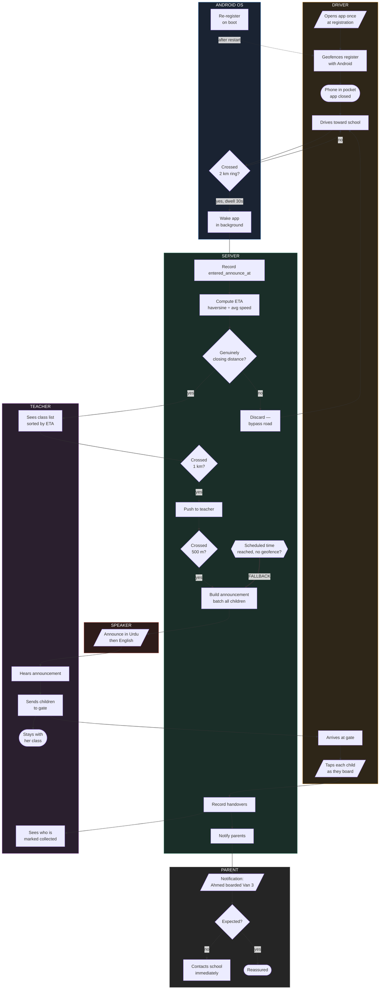
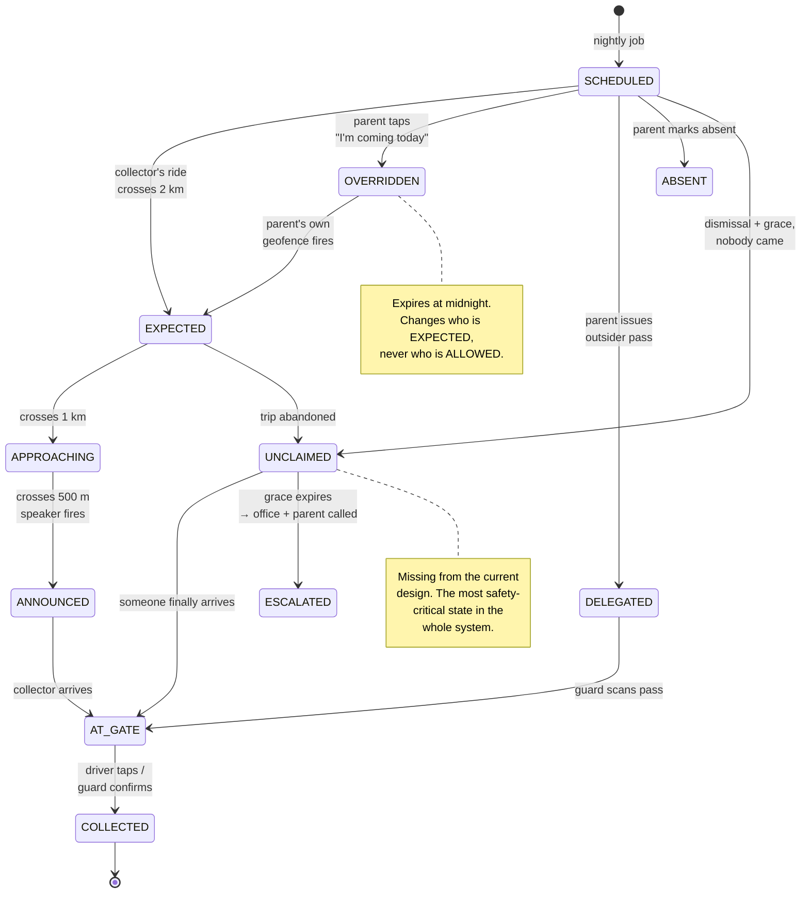
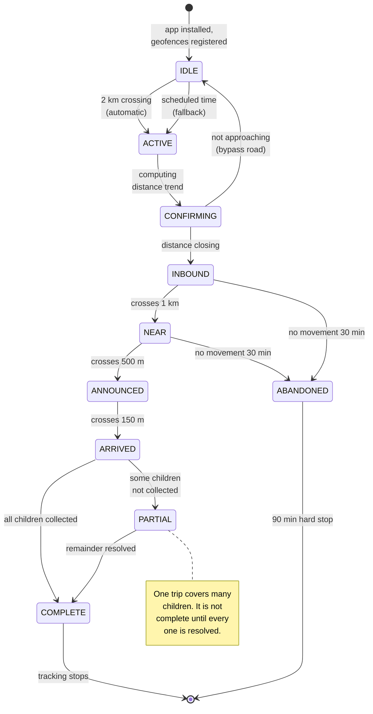
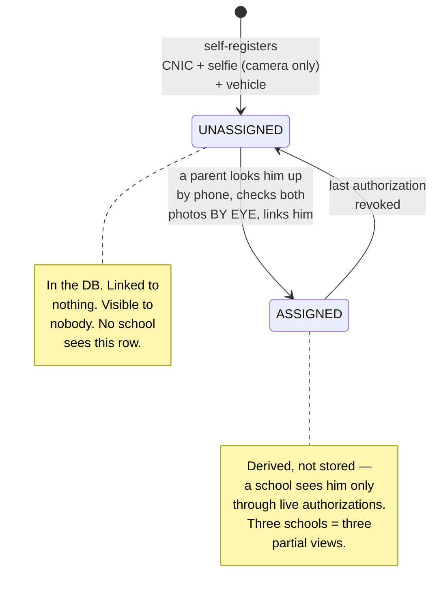
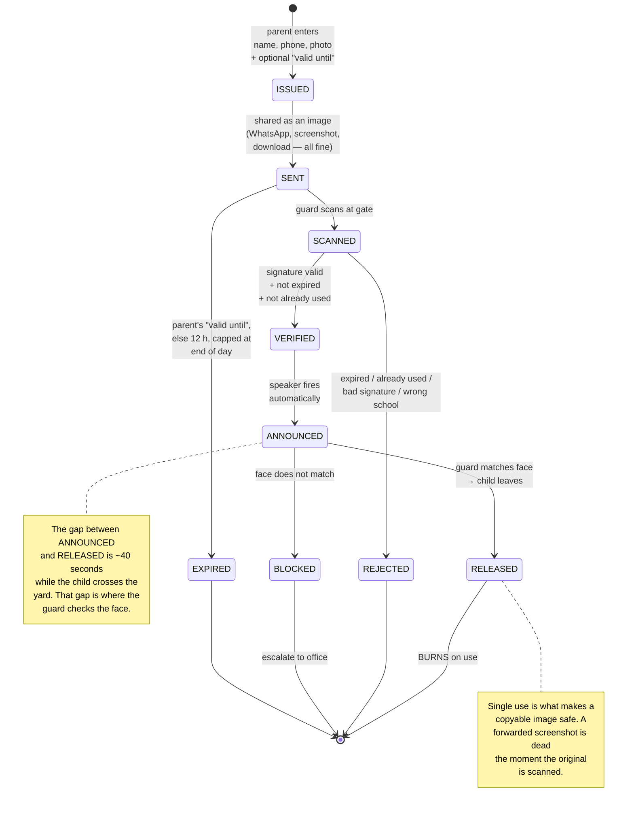
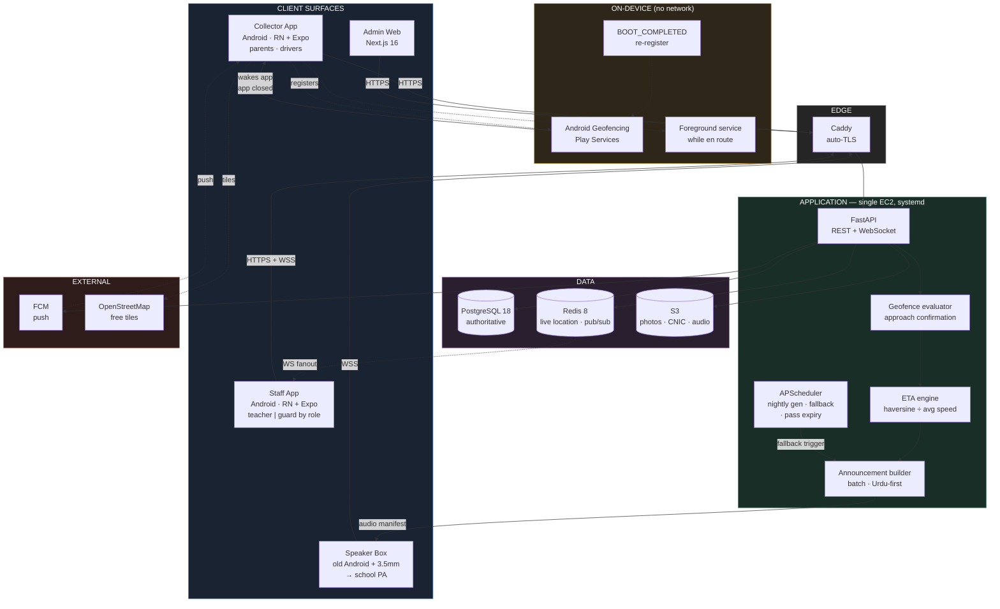
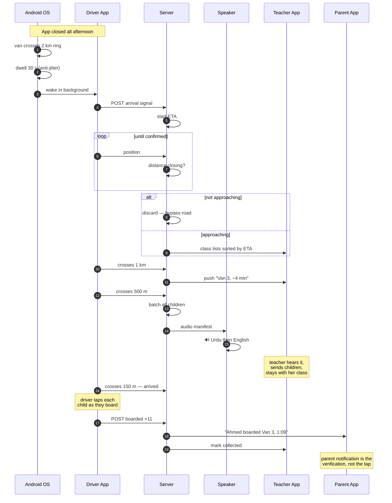
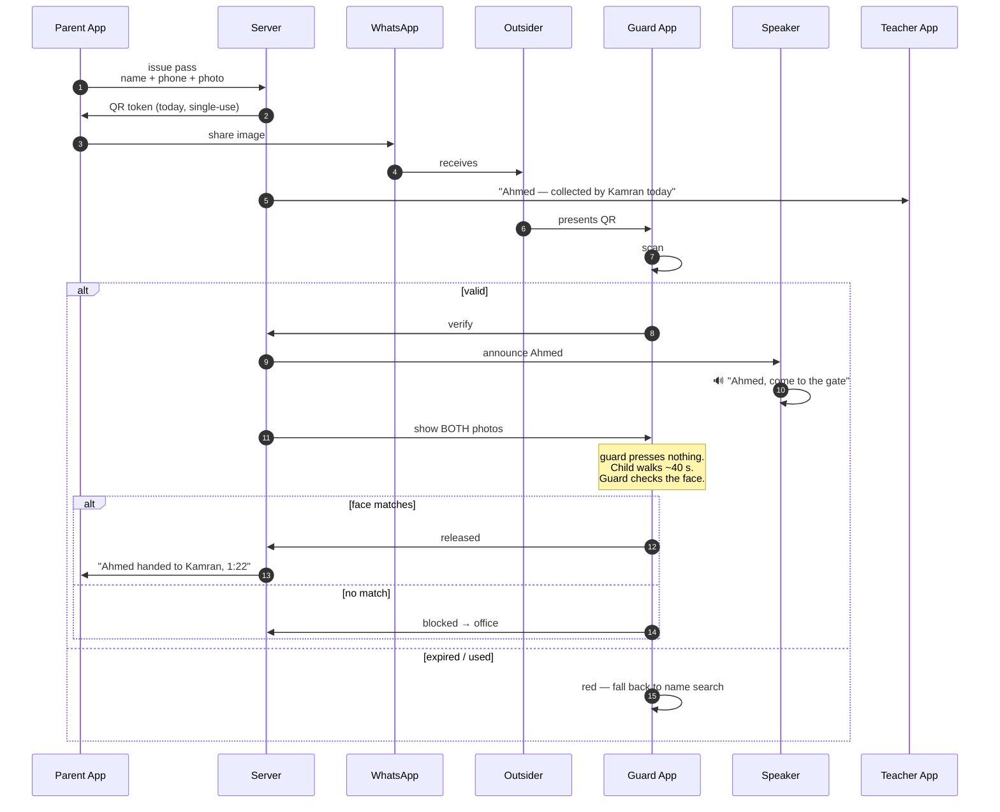
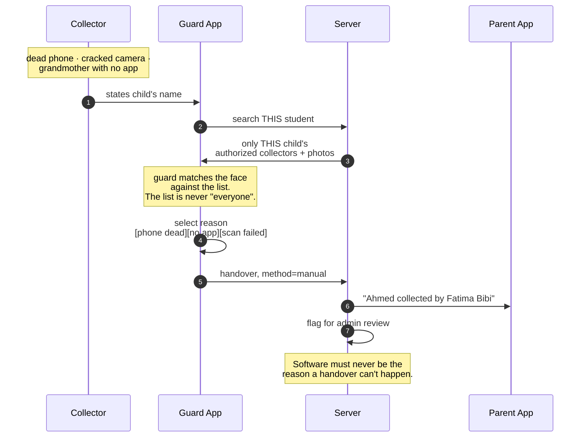

# Rukhsat — System Diagrams

**Companion to `HANDOUT.md`.** These diagrams show the *proposed* system, not
the one currently in `main`. Where the two differ, the difference is called out.

Diagrams are Mermaid — they render natively on GitHub, no tooling needed.

**Contents**

1. [Use Case Diagram](#1-use-case-diagram) — who can do what
2. [Activity Diagram](#2-activity-diagram) — the afternoon, end to end
3. [State Diagrams](#3-state-diagrams) — pickup, trip, driver, pass
4. [System Architecture](#4-system-architecture) — components and how they connect
5. [Sequence Diagrams](#5-sequence-diagrams) — the three collection paths
6. [Data Model](#6-data-model) — entities and relationships

---

## 1. Use Case Diagram

Who can do what. Note what is **absent**: a driver has no path to search or
browse students. That endpoint does not exist.


### The two rules this diagram encodes

**Only a parent grants access to a child.** `P3 → D3` is the only edge that
fills a driver's manifest. There is no admin bulk-assign, and no driver
self-claim.

**No student search for drivers.** There is deliberately no `D-x` box for
"find students." Even a zero-result search confirms whether a child attends the
school, so the endpoint must not exist — a missing endpoint cannot be called
with a broken role check.

---

## 2. Activity Diagram

One afternoon, all actors, swimlaned. This is the **van path**; the parent and
outsider paths are in §5.



### Four things to notice

**The driver's lane is nearly empty.** One action at registration, one tap per
child at the gate. Everything between is the OS and the server. That is the
whole design goal — he never has to remember anything.

**`s11` is the fallback and it is load-bearing.** Geofences fire late or not at
all: Android batches events, and Xiaomi/Oppo/Vivo/Infinix kill background apps
aggressively — all extremely common here. If the driver's own expected arrival
time passes with no geofence, announce anyway. The school never notices the
difference.

**`s3` prevents the failure that would kill adoption.** A 2 km circle includes
bypass roads. Announcing for a van that never arrives destroys teacher trust,
and trust doesn't come back. One confirmation cycle costs 30 seconds and is
worth it.

**`t4` — the teacher never leaves.** She has 30 children, maybe 8 registered.
Every flow that pulls her to the gate fails at the most chaotic minute of the
day. `SYSTEM_PLAN.md` already caught this once; it's easy to lose again.

---

## 3. State Diagrams

### 3.1 Pickup — per child, per day



**`UNCLAIMED` and `ESCALATED` do not exist in the current model.** "Parent never
comes" is the single most safety-critical scenario in this domain and neither
the original plan nor the shipped contract has a state for it. A child standing
at the gate after dismissal must produce an alert, not silence.

**`OVERRIDDEN` never restricts.** If the mother taps "I'm coming today" and then
her car breaks down, the driver can still collect. The override changes
*expectation*, not *authorization* — otherwise a well-meaning tap strands a
child.

### 3.2 Trip — per collector, per day



**Tracking stops at `COMPLETE`.** No forgotten sessions, 90-minute hard cap.

**`PARTIAL` matters for vans.** One trip, fourteen children. If the driver taps
eleven and drives off, the trip is not complete and three children are
unaccounted for. Marking the trip done on arrival would silently lose them.

### 3.3 Driver registration



**No admin approval step.** The van is a private contract between parent and
driver. The school is not party to it and should not carry the liability of
having "approved" anyone. When a lawyer asks who approved this man, the answer
is *"the parent did, on 3 September, here is the log."*

**No automated face matching** — agreed with Tehman, shipped in `9594e8b`. Both
photos are stored and shown; the **parent verifies by eye** when she links him.
An algorithm reporting "82% match" is worse than a person looking at a picture:
she already knows the man she hired, and if the score disagreed with her, either
she overrides it (so it did nothing) or it overrides her (so it blocks on worse
evidence). It also drops an ML dependency that would need its own cost,
accuracy, and biometric-privacy justification.

What survives from the original proposal is the part doing the actual work:
**camera-only selfie for drivers**. A gallery upload can be any image off the
internet, and the driver is the highest-privilege actor in the system.

**`ASSIGNED` is derived, not a stored flag** — Tehman's improvement on the
proposal. A stored flag drifts: revoke the last link and a stale `ASSIGNED`
leaves a driver visible to a school he no longer serves.

### 3.4 One-off outsider pass

**This is a STATIC QR, and deliberately so** — not a variant of the rotating
trip token in `qr_tokens.py`.

Rotation exists because a registered collector's code is *long-lived*: she shows
it every day for a year, so a leaked screenshot would work forever. This pass
has no such problem — it is scoped to one child, one person, one use. And the
delivery method requires it: a code sent as a WhatsApp image cannot rotate.



### Expiry — optional, with a safe default

The parent may set **"valid until"** when issuing the pass. She knows what we
don't: *"my brother is coming sometime between 1 and 3."*

| Case | Behaviour |
|---|---|
| Parent sets a time | Valid until then |
| Parent sets nothing | **12 hours**, capped at end of day |
| Scanned | **Burns immediately**, regardless of remaining time |

**Why a user-set lifetime is fine here but not on the rotating token.** On the
trip token, 60 seconds *is* the security property — exposing it as a preference
would let a parent recreate the static code the whole design exists to prevent.
Here the lifetime is not what makes the pass safe. Three other things are:
single-use, the photo, and the scope to one child. Given those, one hour versus
four changes very little.

**Cap at end of day regardless.** A pass still live tomorrow is a real risk and
no legitimate case needs one.

### What actually carries the security

Since the code is copyable by design, two things do the work:

**The burn.** Redemption is single-use, so a forwarded copy is dead once the
original is scanned. Enforcing this needs server state — the guard's phone
cannot know a pass was burned on another device. Verify online, fall back to
signature-only offline, reconcile on sync: a duplicate then surfaces as a
flagged event rather than being prevented, which is acceptable because the guard
still checked the face.

**The photo.** Auto-releasing on a valid scan alone means whoever holds the
picture gets the child. The speaker firing automatically is fine — the *child
walking out* is still a human decision, made in the seconds while they cross the
yard.

**Reuses the existing crypto.** Same ES256 key, same public key already on the
guard's phone, same offline verification path. This needs a table, two
endpoints, and a screen — not new cryptography.

---

## 4. System Architecture



### Notes

**The `DEVICE` block is what changes vs. `main`.** Today
`apps/*/app.json` has `blockedPermissions: [ACCESS_BACKGROUND_LOCATION]`, which
strips the permission from the build even if a library requests it. Geofencing
cannot work until that is removed and the Play declaration is filed.

**Geofencing costs nothing.** It is a Play Services OS capability — no API key,
no quota, no billing. It sounds expensive because it sounds sophisticated; it is
just the OS watching a circle.

**No Routes API.** ETA is haversine ÷ rolling average speed. Routes bills per
call and would be hit every 15s per active trip. `SYSTEM_PLAN.md` ruled this out
correctly and it still holds.

**OSM instead of Google Maps** removes the international-card dependency, which
was the riskiest non-technical item on the Day 0 list.

**The speaker box is a client, not infrastructure.** An old Android phone on the
school's existing PA amplifier. If it dies, the guard uses his mic exactly as he
does today.

---

## 5. Sequence Diagrams

### 5.1 Van pickup — zero taps by the driver until boarding



### 5.2 One-off outsider — guard presses nothing



### 5.3 Manual fallback — mandatory, never removable



---

## 6. Data Model

```mermaid
erDiagram
    SCHOOL ||--o{ STUDENT : enrolls
    SCHOOL ||--o{ CLASS : has
    SCHOOL ||--o{ USER : employs
    CLASS  ||--o{ STUDENT : contains

    USER ||--o{ AUTHORIZATION : "granted to"
    USER ||--o{ AUTHORIZATION : "granted by"
    STUDENT ||--o{ AUTHORIZATION : "for"

    VAN ||--o| USER : "assigned driver"
    VAN ||--o{ AUTHORIZATION : "via"

    STUDENT ||--o{ PICKUP : "daily"
    STUDENT ||--o{ TEMP_PASS : "for"
    STUDENT ||--o{ OVERRIDE : "for"
    USER ||--o{ TRIP : makes
    TRIP ||--o{ PICKUP : covers
    PICKUP ||--o| HANDOVER : "ends in"

    SCHOOL {
        uuid id PK
        float lat
        float lng
        int announce_radius_m "2000"
        int gate_radius_m "150"
        time dismissal_time
    }
    STUDENT {
        uuid id PK
        string guardian_cnic "REQUIRED — match key"
        string guardian_phone
        string photo_url
    }
    USER {
        uuid id PK
        enum role "parent|driver|teacher|guard|admin"
        string cnic
        string photo_url
        string id_card_url
        enum verification_status
    }
    VAN {
        uuid id PK
        string vehicle_number
        uuid assigned_driver_id FK "reassignable"
        time expected_arrival_time "driver sets"
        enum status "unassigned|assigned"
    }
    AUTHORIZATION {
        uuid id PK
        uuid student_id FK
        uuid collector_user_id FK
        uuid van_id FK "nullable"
        uuid granted_by_user_id FK "the parent"
        date active_from
        date active_until
    }
    TEMP_PASS {
        uuid id PK
        string holder_name
        string holder_phone
        string photo_url "REQUIRED"
        string qr_token "STATIC, ES256"
        timestamp expires_at "parent-set, else +12h, capped EOD"
        timestamp used_at "single use — burns"
    }
    OVERRIDE {
        uuid id PK
        date date "expires midnight"
        uuid collector_user_id FK
        timestamp notified_driver_at
    }
    TRIP {
        uuid id PK
        timestamp entered_announce_at
        timestamp entered_gate_at
        int eta_seconds
    }
    HANDOVER {
        uuid id PK
        enum method "arrival|driver_tap|temp_pass|placard|manual"
        uuid confirmed_by_user_id FK
        timestamp confirmed_at
    }
```

### Three modelling decisions

**`VAN` is an entity; the driver is an assignment.** Drivers get sick and get
replaced. If the model is "driver," a substitute breaks fourteen authorizations
at once. With `assigned_driver_id` reassignable, every parent authorization
survives because it was granted to the van.

**`AUTHORIZATION.granted_by_user_id` is the audit spine.** It answers "who
decided this man can take my child" with a name and a timestamp. That question
gets asked exactly once, and only when something has gone wrong.

**`STUDENT.guardian_cnic` must be NOT NULL.** Name matching produces false
positives — two "Muhammad Ali" guardians in a 300-student school means one man
gets another man's children. CNIC is a 13-digit government-issued unique number.
Exact match, no transliteration problem.

---

## 7. Status against `main`

Updated 7 Aug 2026, against `30ed934`. Most of the proposal has shipped.

### Landed

| Element | Where |
|---|---|
| Collector model — drivers self-register, parents link | `9594e8b` |
| No school approval; `/schools/{id}/drivers` derived from live authorizations | `9594e8b` |
| CNIC as the parent-matching key | `9594e8b` |
| Camera-only selfie for drivers | `9594e8b` |
| `expected_arrival` on vehicles — *"the BACKBONE of arrival detection"* | `9594e8b` |
| **Student-data leak closed** — driver's only view is `/me/manifest` | `885ec5b` |
| Phone lookup, not search — cannot browse drivers | `d09060b` |
| OpenStreetMap via Leaflet, no Google key | `d09060b` |
| Speaker chain complete — pairing, cached clips, live announce | `30ed934` |
| Pre-recorded clips over TTS | `30ed934` |

`885ec5b` is worth noting: every student endpoint was reachable by any
authenticated user, verified live in production — a driver's token returned the
full roster, any child's guardians, and all vehicles. The role guard now sits on
the route rather than as a filter inside it, so there is no handler to reach.

### Changed by agreement

**Automated face matching removed** (`9594e8b`). See §3.3 — the parent verifies
by eye. Agreed.

### Still open

| Element | Current `main` |
|---|---|
| **Geofence wakes closed app** | `blockedPermissions` still strips `ACCESS_BACKGROUND_LOCATION`; `POST /trips/start` is still *"'On my way'"* |
| `VEHICLE` as entity, driver as reassignable assignment | driver change breaks every authorization at once |
| `UNCLAIMED` / `ESCALATED` states | no state for "nobody came" |
| 2 km announce + 150 m gate rings | single `geofence_radius_m`, default 1000 |
| Static outsider pass (§3.4) | no `temp_passes` table, no endpoint |

**Background location is the one real disagreement left.** Everything else is
either shipped or unbuilt-but-uncontested.

The case is now *stronger* than when the handout was written, because
`expected_arrival` shipped. The schedule backbone exists — so the geofence
becomes precision layered on something that already works, rather than a
replacement for the trip model. That is a much smaller change than it was two
days ago.

**The outsider pass is the cleanest open piece.** ES256 signing, the guard
scanner, and the speaker chain all exist. It needs a table, two endpoints, and a
screen.
